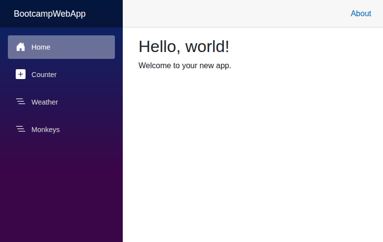
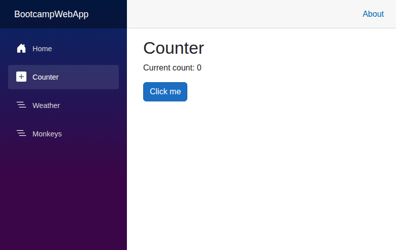
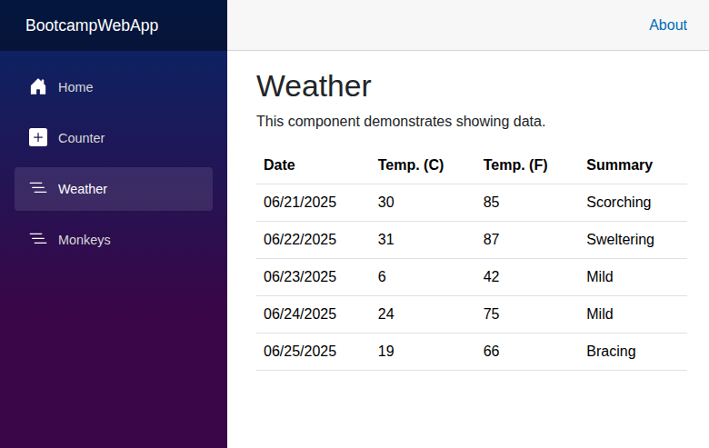
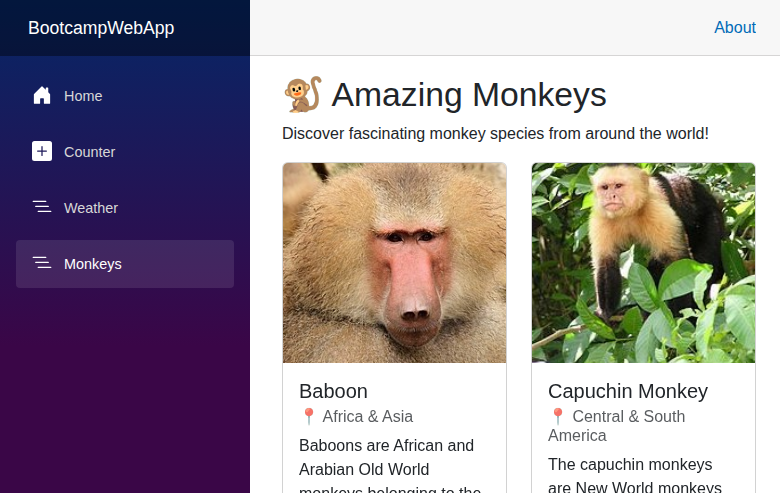

# Testing Bootcamp

A sample .NET 9 Blazor Server application demonstrating various web development concepts and testing practices.

## Overview

This web application features four main pages showcasing different aspects of modern web development:

- **Home**: A welcoming landing page
- **Counter**: An interactive component demonstrating client-side state management
- **Weather**: A data-driven page displaying weather forecast information
- **Monkeys**: A dynamic gallery showcasing various monkey species from around the world

## Screenshots

### Home Page

### Counter Page

### Weather Page

### Monkeys Page

## Technologies Used

- .NET 9
- Blazor Server
- Bootstrap for styling
- C# for server-side logic

## Getting Started

1. Ensure you have .NET 9 SDK installed
2. Clone this repository
3. Navigate to the `src/BootcampWebApp` directory
4. Run `dotnet run` to start the application
5. Open your browser to `http://localhost:5086`

## Testing

The application includes comprehensive unit tests using:
- xUnit for testing framework
- bUnit for Blazor component testing
- NSubstitute for mocking

Run tests with: `dotnet test`