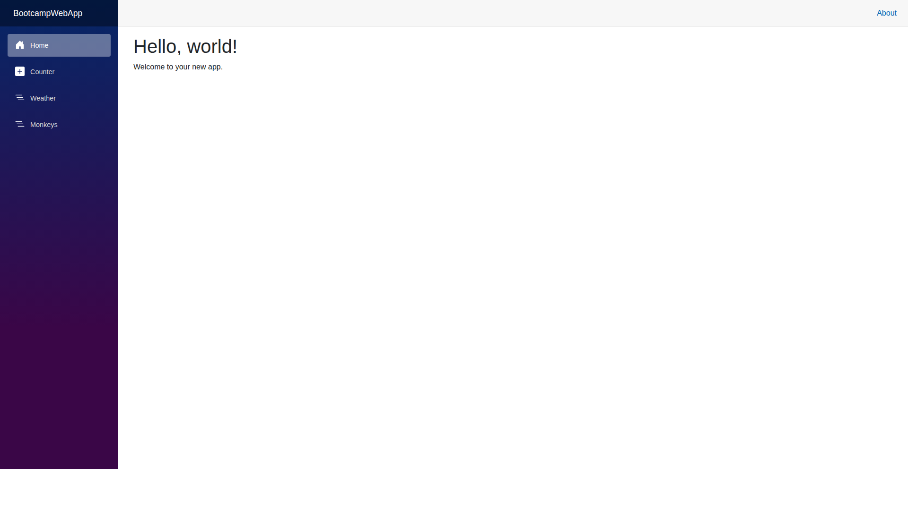
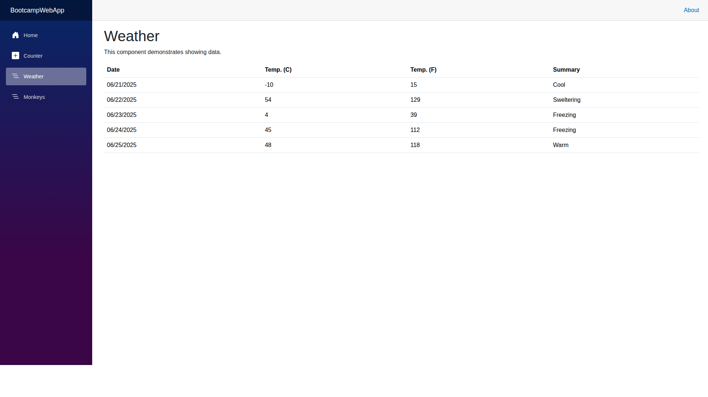
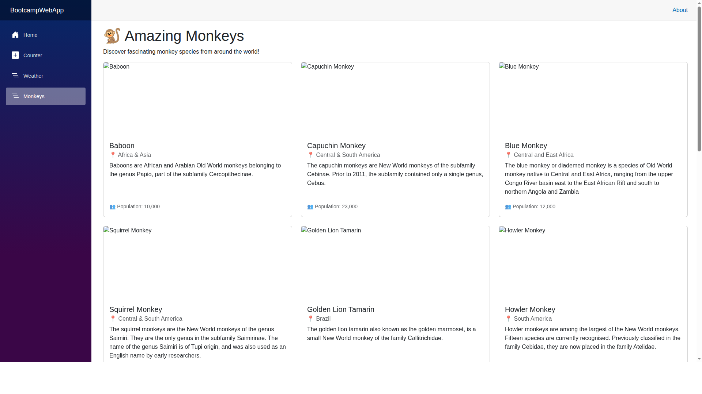

# Testing Bootcamp - Blazor Web Application

A comprehensive Blazor Server application demonstrating modern web development practices with .NET 9, featuring multiple interactive pages and comprehensive testing.

## 🚀 Features

This application showcases various Blazor components and functionality:

- **Home Page**: Welcome landing page with application introduction
- **Counter**: Interactive counter component demonstrating Blazor state management
- **Weather**: Dynamic weather forecast display with data services
- **Monkeys**: Rich data presentation showing monkey species information with images

## 🏗️ Architecture

- **Framework**: .NET 9 Blazor Server
- **UI Framework**: Bootstrap for responsive design
- **Testing**: xUnit with bUnit for Blazor component testing
- **Mocking**: NSubstitute for dependency injection testing
- **Services**: HTTP client services for external data integration

## 📸 Application Screenshots

### Home Page
The main landing page welcoming users to the application.



### Counter Page
An interactive counter demonstrating Blazor's reactive UI capabilities.


### Weather Page
Displays weather forecast data in a clean, tabular format.



### Monkeys Page
A rich display of monkey species with images, locations, and population data.



## 🛠️ Getting Started

### Prerequisites
- .NET 9 SDK

### Running the Application

1. Clone the repository:
   ```bash
   git clone https://github.com/mattleibow/testing-bootcamp.git
   cd testing-bootcamp
   ```

2. Build the solution:
   ```bash
   dotnet build
   ```

3. Run the application:
   ```bash
   cd src/BootcampWebApp
   dotnet run
   ```

4. Open your browser and navigate to the URL displayed in the console (typically `http://localhost:5086`)

### Running Tests

Execute the test suite to verify application functionality:

```bash
dotnet test
```

## 🧪 Testing Strategy

The application includes comprehensive testing covering:

- **Component Testing**: Using bUnit to test Blazor component rendering and interactions
- **Service Testing**: Mock-based testing of data services using NSubstitute
- **Integration Testing**: End-to-end testing of component and service integration

### Test Coverage

- ✅ Home page component rendering
- ✅ Counter functionality and state management
- ✅ Weather service integration and data display
- ✅ Monkeys service integration with loading states
- ✅ Error handling and edge cases

## 🏃‍♂️ Development

The application demonstrates modern .NET development practices including:

- Dependency injection for service management
- Separation of concerns with dedicated service layers
- Responsive design with Bootstrap integration
- Component-based architecture
- Comprehensive unit testing

## 📁 Project Structure

```
src/
├── BootcampWebApp/           # Main Blazor application
│   ├── Components/           # Blazor components
│   │   ├── Pages/           # Page components (Home, Counter, Weather, Monkeys)
│   │   └── Layout/          # Layout components
│   ├── Models/              # Data models
│   ├── Services/            # Business logic and data services
│   └── Program.cs           # Application startup
└── BootcampWebApp.Tests/    # Test project
    └── Components/          # Component tests
```

## 📄 License

This project is licensed under the MIT License - see the [LICENSE](LICENSE) file for details.